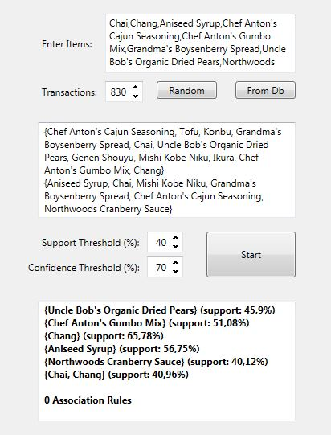
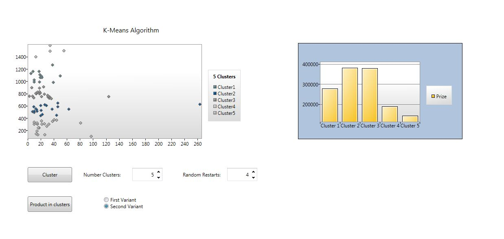

# Market basket analysis

## What is it?

Market Basket Analysis is a modelling technique based upon the theory that if you buy a certain group of items, you are more (or less) likely to buy another group of items.  It is used to determine what items are frequently bought together or placed in the same basket by customers.  It does not mean that since energy drinks and video games are frequently bought together, one is the cause for the purchase of the other, but it can be construed from the information that this purchase is most probably made by (or for) a gamer. Such rules or hypothesis must be tested and should not be taken as truth unless item sales say otherwise.

Information about implementation of this system can be found in this [document](MarketBasket_Documentation(BG).pdf) 
